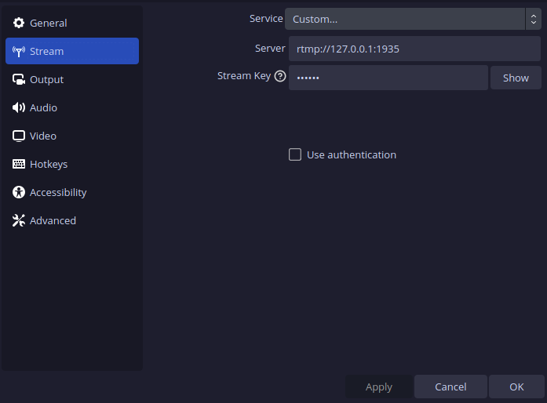

<div align="center">


# Stream Sprout

**Restream a video source to multiple destinations such as Twitch, YouTube, Owncast and Peertube**

**Made with 💝 for  & **
</div>

<p align="center">
  &nbsp;<a href="https://wimpysworld.io/discord" target="_blank"></a>&nbsp;
  &nbsp;<a href="https://fosstodon.org/@wimpy" target="_blank"></a>&nbsp;
  &nbsp;<a href="https://twitter.com/m_wimpress" target="_blank"></a>&nbsp;
  &nbsp;<a href="https://linkedin.com/in/martinwimpress" target="_blank"></a>&nbsp;
</p>

# Introduction

Stream Sprout 🌱 is a simple, self-contained, and easy-to-use solution for streaming to multiple destinations such as Twitch, YouTube, [Owncast](https://owncast.online/) and [Peertube](https://joinpeertube.org/) 📡

<div align="center">
  
</div>

It uses [FFmpeg](https://ffmpeg.org/) to receive the video stream from OBS Studio (or any encoder that can produce RTMP) and then restreams it to multiple destinations. This provides similar functionality as services like Restream.io and Livepush.io but without the need to pay 💸 for a third-party service or run something like nginx with the [RTMP module](https://github.com/arut/nginx-rtmp-module).

Stream Sprout is configured with a simple YAML file and designed to be run on the same computer as your [OBS Studio](https://obsproject.com/) instance (it can be run remotely, [**with appropriate security measures**](#-ffmpeg-rtmp-server-accepts-any-rtmp-stream-on-the-listening-port-), and does not require root privileges.

There is no transcoding or processing of the video stream 🎞️
The stream is received and then restreamed to the destinations you configure without modification.
Optionally you can also archive the stream to disk 💾

While the restreaming process is lightweight, **your bandwidth requirements will increase with each destination you add.** 📈
Ensure you have sufficient bandwidth to support the number of destinations you intend to stream to ⤴️

Stream Sprout is developed on Linux 🐧 and should work on macOS 🍏 or any other platform that supports `bash` and `ffmpeg` 👍️

## Get Started

- [Install](#installation) Stream Sprout 🧑‍💻
- [Configure](#configure-stream-sprout) Stream Sprout 🧑‍💻
- [Configure](#configure-obs-studio) OBS Studio 🎛️
- Start `stream-sprout` ⌨️
- Click the *Start Streaming* button in OBS Studio 🖱️
- Do you your thing 🎥
- Click the *Stop Streaming* button in OBS Studio 🖱️
- <kbd>Ctrl</kbd> + <kbd>C</kbd> to stop `stream-sprout` ⌨️

## Installation

### Debian

- Download the Stream Sprout .deb package from the [releases page](https://github.com/wimpysworld/stream-sprout/releases) 📦️
- Install it with `apt-get install ./stream-sprout_0.1.5-1_all.deb`.

### macOS

Install the Stream Sprout requirements using `brew`:

```shell
brew install bash ffmpeg
```

Now clone the project:

```shell
git clone https://github.com/wimpysworld/stream-sprout.git
cd stream-sprout
```

### Nix & NixOS

[](https://flakehub.com/flake/wimpysworld/stream-sprout)

Stable releases of Stream Sprout are published to FlakeHub for Nix users ❄️
See the flake on FlakeHub for more details:

- <https://flakehub.com/flake/wimpysworld/stream-sprout>

### Snap

[](https://snapcraft.io/stream-sprout)

For Linux distributions that support snap packages, Stream Sprout is available from the Snap Store 🛍️

```shell
sudo snap install stream-sprout
```

### Ubuntu

- Download the Stream Sprout .deb package from the [releases page](https://github.com/wimpysworld/stream-sprout/releases) 📦️
- Install it with `apt-get install ./stream-sprout_0.1.5-1_all.deb`.

### Docker & Podman

#### Pull the container

The Stream Sprout container image is available from the GitHub Container Registry for amd64 and arm64.
To pull the latest container image:

```shell
docker pull ghcr.io/wimpysworld/stream-sprout:latest-alpine
```

Or if you want a specific version:

```shell
docker pull ghcr.io/wimpysworld/stream-sprout:0.1.5-alpine
```

#### Run the container

The `stream-sprout.yaml` configuration file will be on the host computer so you need mount a volume to access it from the container.

If you have already pulled the container image, you can run Stream Sprout with:

```shell
docker run -p 1935:1935 -it -v $PWD:/data stream-sprout --config /data/stream-sprout.yaml
```

If you have not pulled or built the container image, you can run Stream Sprout with:

```shell
docker run -p 1935:1935 -it -v $PWD:/data ghcr.io/wimpysworld/stream-sprout:alpine-latest --config /data/stream-sprout.yaml
```

- The `-p 1935:1935` part will expose the RTMP server port `1935` on the host computer.
  - If you have configured Stream Sprout to use a different port, you should change the port number here too.
- The `-it` options will run the container in interactive mode.
- The `-v $PWD:/data` part will mount your current directory `$PWD` as `/data` within the container, allowing you to access your files using the `/data` path.

#### Build the container

Build the Stream Sprout container image:

```shell
docker build -t stream-sprout .
```

### From source

You need to have [FFmpeg](https://ffmpeg.org/) on your system.

```bash
git clone https://github.com/wimpysworld/stream-sprout.git
cd stream-sprout
```

## Configure Stream Sprout

Copy the [example Stream Sprout configuration](https://github.com/wimpysworld/stream-sprout/blob/main/stream-sprout.yaml.example) and edit it to suit your needs 📝

You can specify the configuration file to use with the `--config <path>` option.
If you don't specify a configuration file, Stream Sprout will look for a configuration file in the following locations, in this order:

- Current working directory `./stream-sprout.yaml`
- XDG configuration directory `$XDG_CONFIG_HOME/stream-sprout.yaml` (*Linux*) or `~/.config/stream-sprout.yaml` (*macOS*)
- `/etc/stream-sprout.yaml`

### Server

Here's an example configuration for the Stream Sprout `server:` section.

```yaml
server:
  ip: 127.0.0.1
  port: 1935
  app: sprout
  key: create your key with uuidgen here
  archive_stream: false
  archive_path: ~/Streams
```

The `server:` section is used to configure the RTMP server that Stream Sprout creates.
- The default `ip` address is `127.0.0.1`. Use `0.0.0.0` to allow connections to any network interface.
  - If you remotely host Stream Sprout, use an IP address that is accessible by your computer that runs OBS Studio.
- The default `port` for RTMP is `1935`, but you can use any port between `1024` and `65535`.
- The default `app` name is `sprout`, but you can use any name you like.
- Set `key:` to a secure value to prevent unauthorized access. Running `uuidgen` will generate a suitable value.

The IP address, port, app name and key are composed to create the RTMP URL that you will use in OBS Studio.
For example, `rtmp://ip:port/app/key`.

### 🚨 FFMPEG WILL ACCEPT ANY RTMP STREAM ON THE CORRECT PORT 🚨

**FFmpeg does not currently enforce `app` or `key` paths for its incoming RTMP server.**
**Regardless of the `app` or `key` you set in the Stream Sprout YAML FFmpeg will accept *any* incoming stream on the correct `port`**

⚠️ Do not expose the Stream Sprout RTMP server to the public internet without additional security measures ⚠️
- Consider using a VPN or SSH tunnel to secure the connection 🔐
- Or firewall the RTMP port to only allow connections from trusted IP addresses 🔥🧱
- See the [Limitations section](#limitations) section below for more information.

#### Archive streams

If `archive_stream:` is `true` Stream Sprout will archive the stream to disk in the directory specified by `archive_path:`.
If `archive_path:` is not accessible, Stream Sprout will fallback to using the current working directory.

### Services

`services:` are arbitrarily named.
**Just create an entry for each RTMP destination you want to stream to.**
The example configuration includes entries for Trovo, Twitch, and YouTube but any RTMP destination can be added.

```yaml
services:
  my-rtmp-destination:
    enabled: true
    rtmp_server: "rtmp://rtmp.example.com/live/"
    key: "my_super_secret_stream_key"
```

### Twitch

Here's an example configuration for Twitch.

```yaml
services:
  twitch:
    enabled: true
    rtmp_server: "rtmp://live.twitch.tv/app/"
    key: "your_twitch_stream_key"
```

#### Ingest servers

The example configuration uses the primary Twitch ingest endpoint, which is `rtmp://live.twitch.tv/app/`.
If you want to optimize your stream latency, you can use a Twitch ingest endpoint closer to your location.
A short list of recommended endpoints, based on your whereabouts, is available from [Recommended Ingest Endpoints For You](https://help.twitch.tv/s/twitch-ingest-recommendation).

You can find a complete list of Twitch ingest endpoints from <https://twitchstatus.com/>.

#### Testing

If you want to test streaming to Twitch without going live, you can use the `?bandwidthtest=true` query parameter.

Add `?bandwidthtest=true` to the end of your Twitch stream key, this will enable bandwidth testing, which you can monitor using <https://inspector.twitch.tv/>, and the stream will not go live on your channel.

### YouTube

Here's an example configuration for YouTube.

```yaml
services:
  youtube:
    enabled: true
    rtmp_server: "rtmp://a.rtmp.youtube.com/live2/"
    key: "your_youtube_stream_key"
```

## Configure OBS Studio

- Open OBS Studio
- Go to `Settings` > `Stream`
- Select `Custom` from the `Service` dropdown
- Copy the server `url:` from your Stream Sprout configuration to the `Server` field:
  - `rtmp://127.0.0.1:1935/sprout` (*default*)
- Copy the `key:` (if you specified one) from your Stream Sprout configuration to the `Stream Key` field



## Limitations

- Protecting the Stream Sprout RTMP server with a key does not work
  - FFmpeg does not currently support enforcing RTMP stream app paths or keys
  - https://www.reddit.com/r/ffmpeg/comments/s4keuu/enforce_rtmp_stream_keys_and_strict_paths/
  - https://patchwork.ffmpeg.org/project/ffmpeg/patch/20190925185708.70924-1-unique.will.martin@gmail.com/
```
  [rtmp @ 0x2ca9be80] Unexpected stream STREAMBOMB, expecting c5b559b2-589d-4925-a28e-20d1954fd6c5
    Last message repeated 1 times
```
- Stream Sprout does not support restreaming using secure RTMP (RTMPS).
  - *At least I don't think it does, but I haven't fully tested it.*
    - Kick only appears to support rtmps:// URLs and Stream Sprout restreams do not appear on Kick.
  - https://superuser.com/questions/1438939/live-streaming-over-rtmps-using-ffmpeg
- Each destination you add will increase your bandwidth requirements.

## References

These are some of the references used to create this project:

- https://trac.ffmpeg.org/wiki/EncodingForStreamingSites
- https://ffmpeg.org/ffmpeg-protocols.html#rtmp
- https://ffmpeg.org/ffmpeg-formats.html#flv
- https://ffmpeg.org/ffmpeg-formats.html#tee-1
- https://obsproject.com/forum/resources/obs-studio-stream-to-multiple-platforms-or-channels-at-once.932/
- https://stackoverflow.com/questions/16658873/how-to-minimize-the-delay-in-a-live-streaming-with-ffmpeg
- https://dev.to/ajeetraina/run-ffmpeg-within-a-docker-container-a-step-by-step-guide-c0l
- https://github.com/jrottenberg/ffmpeg
