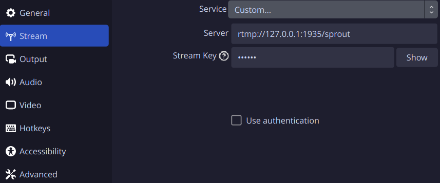

<div align="center">


# Stream Sprout

**Restream a video source to multiple destinations such as Twitch, YouTube, Owncast and Peertube**

**Made with 💝 for  & **
</div>

<p align="center">
  &nbsp;<a href="https://wimpysworld.io/discord" target="_blank"></a>&nbsp;
  &nbsp;<a href="https://fosstodon.org/@wimpy" target="_blank"></a>&nbsp;
  &nbsp;<a href="https://twitter.com/m_wimpress" target="_blank"></a>&nbsp;
  &nbsp;<a href="https://linkedin.com/in/martinwimpress" target="_blank"></a>&nbsp;
</p>

# Introduction

Stream Sprout 🌱 is a simple, self-contained, and easy-to-use solution for streaming to multiple destinations such as Twitch, YouTube, [Owncast](https://owncast.online/) and [Peertube](https://joinpeertube.org/) 📡

<div align="center">
  
</div>

It uses [FFmpeg](https://ffmpeg.org/) to receive the video stream from OBS Studio (or anything that can publish a RTMP stream) and then restreams it to multiple destinations; providing similar functionality as services like Restream.io and Livepush.io but without the need to pay 💸 for a third-party service or run something like nginx with the [RTMP module](https://github.com/arut/nginx-rtmp-module).

Stream Sprout is configured with a simple YAML file and designed to be run on the same computer as your [OBS Studio](https://obsproject.com/) instance (it can be run remotely too) and does not require root privileges.

There is no transcoding or processing of the video stream 🎞️
The stream is received and then restreamed to the destinations you configure without modification.
Optionally you can also archive the stream to disk 💾

While the restreaming process is lightweight, **your bandwidth requirements will increase with each destination you add.** 📈
Ensure you have sufficient bandwidth to support the number of destinations you intend to stream to ⤴️

Stream Sprout is developed on Linux 🐧 and should work on macOS 🍏 or any other platform that supports `bash` and `ffmpeg` 👍️

## Get Started

- [Install](#installation) Stream Sprout 🧑‍💻
- [Configure](#configuration) Stream Sprout 🧑‍💻
- [Configure](#configure-obs-studio) OBS Studio 🎛️
- Start `stream-sprout` ⌨️
- Click the *Start Streaming* button in OBS Studio 🖱️
- Do you your thing 🎥
- Click the *Stop Streaming* button in OBS Studio 🖱️
- <kbd>Ctrl</kbd> + <kbd>C</kbd> to stop `stream-sprout` ⌨️

## Installation

### Debian

- Download the Stream Sprout .deb package from the [releases page](https://github.com/wimpysworld/stream-sprout/releases) 📦️
- Install it with `apt-get install ./stream-sprout_0.1.4-1_all.deb`.

### macOS

Install the Stream Sprout requirements using `brew`:

```shell
brew install bash ffmpeg
```

Now clone the project:

```shell
git clone https://github.com/wimpysworld/stream-sprout.git
cd stream-sprout
```

### Nix & NixOS

[](https://flakehub.com/flake/wimpysworld/stream-sprout)

Stable releases of Stream Sprout are published to FlakeHub for Nix users ❄️
See the flake on FlakeHub for more details:

- <https://flakehub.com/flake/wimpysworld/stream-sprout>

### Ubuntu

- Download the Stream Sprout .deb package from the [releases page](https://github.com/wimpysworld/stream-sprout/releases) 📦️
- Install it with `apt-get install ./stream-sprout_0.1.4-1_all.deb`.

### From source

You need to have [FFmpeg](https://ffmpeg.org/) on your system.

```bash
git clone https://github.com/wimpysworld/stream-sprout.git
cd stream-sprout
```

## Configure Stream Sprout

Copy the [example Stream Sprout configuration](https://github.com/wimpysworld/stream-sprout/blob/main/stream-sprout.yaml.example) and edit it to suit your needs 📝

You can specify the configuration file to use with the `--config <path>` option.
If you don't specify a configuration file, Stream Sprout will look for a configuration file in the following locations, in this order:

- Current working directory `./stream-sprout.yaml`
- XDG configuration directory `$XDG_CONFIG_HOME/stream-sprout.yaml` (*Linux*) or `~/.config/stream-sprout.yaml` (*macOS*)
- `/etc/stream-sprout.yaml`

### Server

```yaml
server:
  url: "rtmp://127.0.0.1:1935"
  key: "create your key with uuidgen here"
  archive_stream: false
  archive_path: "${HOME}/Streams"
```

The `server:` section is used to configure the RTMP server that Stream Sprout creates; it must be an RTMP URL.
The default port for RTMP is `1935`, but you can use any port you like.
If you remotely host Stream Sprout, you should use an IP address in the `url:` that accessible by your computer that runs OBS Studio and also set `key:` to a secure value to prevent unauthorized access.
Running `uuidgen` will generate a suitable value.

If `archive_stream:` is `true` Stream Sprout will archive the stream to disk in the directory specified by `archive_path:`.
If `archive_path:` is not accessible, Stream Sprout will fallback to using the current working directory.

Here's an example configuration for the Stream Sprout `server:` section.

### Services

`services:` are arbitrarily named.
**Just create an entry for each RTMP destination you want to stream to.**
The example configuration includes entries for Trovo, Twitch, and YouTube but any RTMP destination can be added.

```yaml
services:
  my-rtmp-destination:
    enabled: true
    rtmp_server: "rtmp://rtmp.example.com/live/"
    key: "my_super_secret_stream_key"
```

### Twitch

Here's an example configuration for Twitch.

```yaml
services:
  twitch:
    enabled: true
    rtmp_server: "rtmp://live.twitch.tv/app/"
    key: "your_twitch_stream_key"
```

#### Ingest servers

The example configuration uses the primary Twitch ingest endpoint, which is `rtmp://live.twitch.tv/app/`.
If you want to optimize your stream latency, you can use a Twitch ingest endpoint closer to your location.
A short list of recommended endpoints, based on your whereabouts, is available from [Recommended Ingest Endpoints For You](https://help.twitch.tv/s/twitch-ingest-recommendation).

You can find a complete list of Twitch ingest endpoints from <https://twitchstatus.com/>.

#### Testing

If you want to test streaming to Twitch without going live, you can use the `?bandwidthtest=true` query parameter.

Add `?bandwidthtest=true` to the end of your Twitch stream key, this will enable bandwidth testing, which you can monitor using <https://inspector.twitch.tv/>, and the stream will not go live on your channel.

### YouTube

Here's an example configuration for YouTube.

```yaml
services:
  youtube:
    enabled: true
    rtmp_server: "rtmp://a.rtmp.youtube.com/live2/"
    key: "your_youtube_stream_key"
```

## Configure OBS Studio

- Open OBS Studio
- Go to `Settings` > `Stream`
- Select `Custom` from the `Service` dropdown
- Copy the server `url:` from your Stream Sprout configuration to the `Server` field:
  - `rtmp://127.0.0.1:1935` (*default*)
- Copy the `key:` (if you specified one) from your Stream Sprout configuration to the `Stream Key` field



## Limitations

- Stream Sprout does not support secure RTMP (RTMPS) at this time.
  - *At least I don't think it does, but I haven't fully tested it.*
- Each destination you add will increase your bandwidth requirements.

## References

These are some of the references used to create this project:

 - https://trac.ffmpeg.org/wiki/EncodingForStreamingSites
 - https://ffmpeg.org/ffmpeg-protocols.html#rtmp
 - https://ffmpeg.org/ffmpeg-formats.html#flv
 - https://ffmpeg.org/ffmpeg-formats.html#tee-1
 - https://obsproject.com/forum/resources/obs-studio-stream-to-multiple-platforms-or-channels-at-once.932/
 - https://stackoverflow.com/questions/16658873/how-to-minimize-the-delay-in-a-live-streaming-with-ffmpeg
